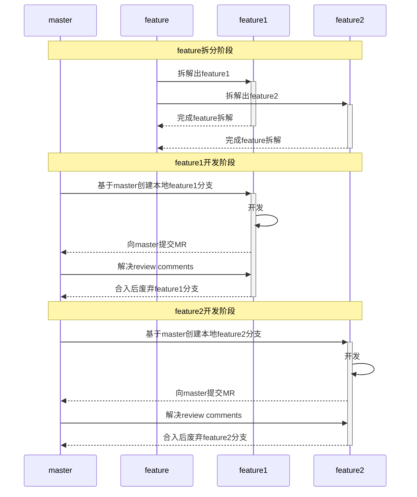

# MR规范

### 现状

- 一次commit包含内容太多，review困难

- commit不具有原子性，一次commit做多件事

- commit信息太少或者不规范

- 本地分支存在周期太长，代码迟迟不能合入master分支


### 规范MR的目的

- 可以加快code review过程
- 规范的commit message可以借助工具自动生成Change log，方便后续自动化发版
- 在需要回退版本定位问题的时候，可以帮助我们迅速找到相应的提交
- commit信息也是程序员的脸面，可以提升项目的整体质量

 规范前commit信息示例

```bash
git log --oneline -5 --author cbeams --before "Fri Mar 26 2009"

2db0f12 fixed two build-breaking issues: + reverted ClassMetadataReadingVisitor to revision 794 + eliminated ConfigurationPostProcessorTests until further investigation determines why it causes downstream tests to fail (such as the seemingly unrelated ClassPathXmlApplicationContextTests)
147709f Tweaks to package-info.java files
22b25e0 Consolidated Util and MutableAnnotationUtils classes into existing AsmUtils
7f96f57 polishing
```

规范后commit信息示例

```bash
git log --online -5

7e06bcc test(mlu_device_test): fix a bug of mlu_device_test.cc
0aae896 feat(relu_grad): adapt sigmoid_grad and leaky_relu_grad
d12f9b5 fix(tf2mlu): (2/n)improve the log of tf2mlu module
75956fe feat(rint): adapt rint op
d2709ef fix(test): solve the problem of partial UT TIMEOUT
```


### MR规范

- MR要具有原子性（[atomic commits](https://link.jianshu.com/?t=http://www.freshconsulting.com/atomic-commits/)），每个提交只做一件事
- 对于比较大的feature开发，需要进行拆解，同时jira也要做对应的拆解，然后分批提交进入master分支
- commit信息要详尽和规范
- 每次commit修改的文件数不能超过10个
- 在MR开始被review后，如果有新的提交禁止使用git commit --amend
- 如果是新功能必须添加对应UT
- 如果是bug修复必须补充UT
- 如果commit影响文档必须包含文档的修改


### MR规范详细介绍

#### 1. MR要具有原子性

**含义：**

- 每个提交只做一件事，如只修复一个bug，只完成一个feature
- 每个提交都是完整的、独立的

**优点：**

- 方便code review和代码合入
- 方便回滚代码

#### 2. Feature拆分

开发大的feature时必须要做feature拆分，最好拆解成独立的2~3人天就可以完成的小feature。

**优点：**

- 加快迭代速度
- 缩短本地分支生命周期，降低维护成本

- 可以帮助审视设计方案是否是模块化的，是否便于维护和测试



#### 3. Commit信息应该怎样写

每次提交，Commit message 都包括三个部分：Header，Body 和 Footer。

```bash
<type>(<scope>): <subject>
// 空一行
<body>
// 空一行
<footer>
```

其中，Header 是必需的，Body 和 Footer 可以省略。

###### Header

Header部分只有一行，包括4个字段：`type`（必需）、`scope`（必填）和`subject`（必需）。下面是一个示例：

```bash
refactor(prepush): refactor the prepush test
```

**（1）type**

`type`用于说明 commit 的类别，只允许使用下面7个标识

- feat: 新功能（feature)
- fix: 修复bug
- docs: 仅修改文档（documentation）
- style: 仅修改格式（不影响代码运行的变动)
- refactor: 重构（即不是新增功能，也不是修改bug的代码变动)
- perf: 性能优化
- test: 测试相关
- build: 构建流程、外部依赖变更，比如升级依赖包
- ci: ci相关的修改

**（2）scope**

`scope`用于说明 本次commit 影响的范围，可以是模块，也可以是具体文件，如果影响范围很大也可以用`*`表示。同时我们可以根据`scope`来确定测试报告的内容，影响范围越大测试的范围和力度也应该越大。

**（3）subject**

`subject`是 commit 目的的简短描述。

- 限制`subject`不超过50个字符

  **tips：**如果你概述的时候发现很困难。可能是因为你一次 commit 太多改动了。尽可能做到 [atomic commits](https://link.jianshu.com/?t=http://www.freshconsulting.com/atomic-commits/)(每次post一个主题)。

- 首字母小写

- 结尾不加句号`.`

- 以动词开头，使用第一人称现在时，比如change，而不是changed或changes。

  如：

```bash
  remove deprecated methods
```

  **tips：**这有一条简单的准则，一个规范的commit描述应该能替换到下面的句子中

```bash
If applied, this commit will <subject>
```

  如将上面的`subject`例子替换：

```bash
If applied, this commit will remove deprecated methods
```

###### Body

Body 部分是对本次 commit 的详细描述，可以分成多行。下面是2个示例：

示例1

```bash
Remove the 'state' and 'exceptmask' from serialize.h's stream
implementations, as well as related methods.

As exceptmask always included 'failbit', and setstate was always
called with bits = failbit, all it did was immediately raise an
exception. Get rid of those variables, and replace the setstate
with direct exception throwing (which also removes some dead
code).
```

示例2

```bash
1. rewrite prepush test with python to support complete senario in future
2. support test case input
3. improve logging
4. update verification method
```

注意：

- 每行72个字符
- 使用第一人称现在时，比如使用`change`而不是`changed`或`changes`
- 应该说明改动了什么，以及为什么改动

###### Footer

Footer 部分只用于三种情况。

**（1）不兼容变动**

如果当前代码与上一个版本不兼容，则 Footer 部分以`BREAKING CHANGE`开头，后面是对变动的描述、以及变动理由和迁移方法。

```bash
BREAKING CHANGE: isolate scope bindings definition has changed.
    To migrate the code follow the example below:

    Before:
    scope: {
      myAttr: 'attribute',
    }

    After:
    scope: {
      myAttr: '@',
    }

    The removed `inject` wasn't generaly useful for directives so
    there should be no code using it.
```

**（2）关闭 Issue**

如果当前 commit 针对某个issue，那么可以在 Footer 部分关闭这个 issue

```bash
Closes #1024
```

**（3）关联 JIRA**

如果当前 commit 针对某个JIRA任务，那么可以在 Footer 部分填写关联的 JIRA

```bash
Re #JIRA_ID
Fix #JIRA_ID
```

`JIRA_ID`用于说明本次commit**直接关联**的JIRA任务。

- 如果修改来自于别人提的JIRA，本次commit必须携带对应的JIRA_ID
- 如果没有对应的JIRA且subject可以描述清楚本次修改，JIRA_ID可以省略
- JIRA_ID必须与本次提交直接相关，禁止使用无关或者无效的JIRA_ID

###### Header、Body和JIRA的关系

- Header描述本次提交的目的，即用来写WHAT
- Body是对本次 commit 的详细描述，即用来写WHY
- JIRA是描述WHY+HOW
- 如果Header和Body都无法描述清楚本次commit，就必须在关联JIRA中进行详细描述


#### 4. Commit格式化工具

Commitizen 是一个帮助撰写规范 commit message 的工具，下面会详细介绍工具的使用。

**(1) 安装**

```bash
pip3 install -U Commitizen
```

**(2) 使用**

使用下面的命令代替git commit会进入interactive模式，然后按照提示依次填写即可。

```bash
cz commit
# 或者用下面的shortcut版本
cz c
```

注意，Commitizen需要依赖python3版本，因此如果python默认版本是2的话，需要将python默认版本改成3，或者创建一个python3的虚拟环境，在虚拟环境中执行cz c命令。

**(3) 示例**

执行cz c命令，进入interactive模式

```bash
cz c
```

```bash
? Select the type of change you are committing (Use arrow keys)
 » fix: A bug fix. Correlates with PATCH in SemVer
   feat: A new feature. Correlates with MINOR in SemVer
   docs: Documentation only changes
   style: Changes that do not affect the meaning of the code (white-space, formatting, missing semi-colons, etc)
   refactor: A code change that neither fixes a bug nor adds a feature
   perf: A code change that improves performance
   test: Adding missing or correcting existing tests
   build: Changes that affect the build system or external dependencies (example scopes: pip, docker, npm)
   ci: Changes to our CI configuration files and scripts (example scopes: GitLabCI)
```

选择commit的`type`，然后按[enter]键，这里以refactor为例：

```bash
? Select the type of change you are committing (Use arrow keys)
   fix: A bug fix. Correlates with PATCH in SemVer
   feat: A new feature. Correlates with MINOR in SemVer
   docs: Documentation only changes
   style: Changes that do not affect the meaning of the code (white-space, formatting, missing semi-colons, etc)
 » refactor: A code change that neither fixes a bug nor adds a feature
   perf: A code change that improves performance
   test: Adding missing or correcting existing tests
   build: Changes that affect the build system or external dependencies (example scopes: pip, docker, npm)
   ci: Changes to our CI configuration files and scripts (example scopes: GitLabCI)
```

填写`scope` ，然后按[enter]键

```bash
? Select the type of change you are committing refactor: A code change that neither fixes a bug nor adds a feature
? What is the scope of this change? (class or file name): (press [enter] to skip)
prepush
```

填写`subject`，然后按[enter]键

```bash
? Write a short and imperative summary of the code changes: (lower case and no period)
refactor the prepush test
```

填写Body部分，如果要换行请使用 `|`，填写完毕后按[enter]键

```bash
? Provide additional contextual information about the code changes: (press [enter] to skip)
1. rewrite prepush test with python to support complete senario in future | 2. support test case input | 3. improve logging | 4. update verification method
```
判断本次提交有不兼容变动，填写完毕后按[enter]键

```bash
? Is this a BREAKING CHANGE? Correlates with MAJOR in SemVer No
```

填写Footer部分，要换行请使用 `|`，如果有不兼容变动需要先描述不兼容相关内容，然后写关联issue或者jira，如果没有不兼容变动则直接写关联issue或者jira，填写完毕后按[enter]键

```bash
? Footer. Information about Breaking Changes and reference issues that this commit closes: (press [enter] to skip)
Re #TENSORFLOW-1421
```

信息填写完毕后会生成格式化后的commit信息

```bash
refactor(prepush): refactor the prepush test

1. rewrite prepush test with python to support complete senario in future
2. support test case input
3. improve logging
4. update verification method

Re #TENSORFLOW-1421
```

#### Q&A

##### Q: 提交需要依赖底层库的更新怎么处理?

A：可以先将开发好的代码提交仓库，只要不影响编译不会break已有功能就行。比如新适配一个算子，可以将算子适配以及测试代码都写好，基本功能测试通过，再注释掉会影响编译的代码就可以提交了，等底层库更新后再进行联调。

##### Q：提交的代码长时间没有人review怎么办?

A：主动找熟悉自己代码相关修改的人review，主动找会受自己代码修改影响的人review，如果对前两条不清楚，就主动找代码所属模块责任人review。

##### Q：在做feature拆分的时候，如果对应的jira已经是子任务了，由于jira限制无法再进行拆分该怎么处理?

A：创建一个新的jira，在新jira下面创建子任务，然后将原jira链接到新jira上。
